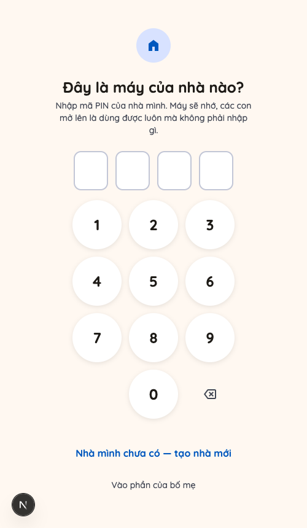
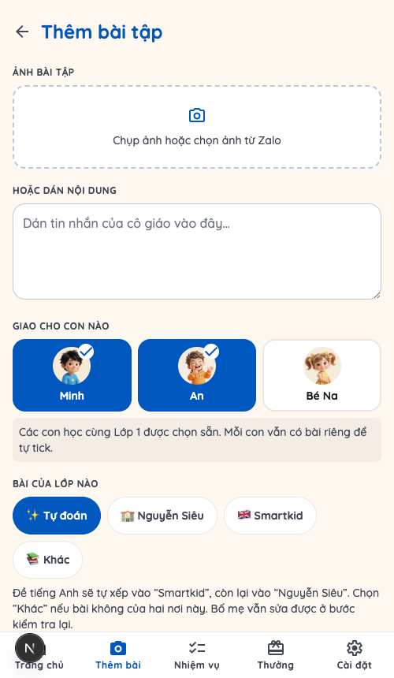
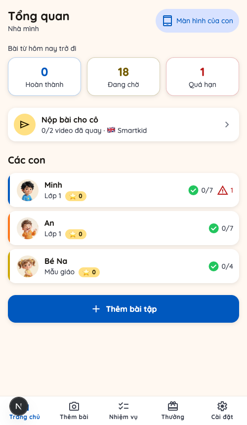
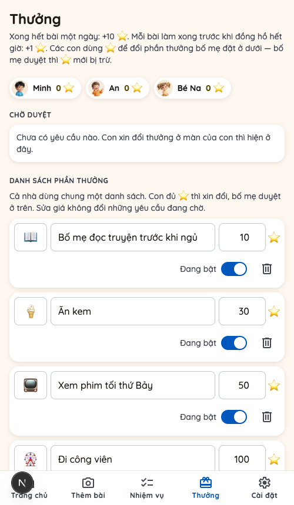
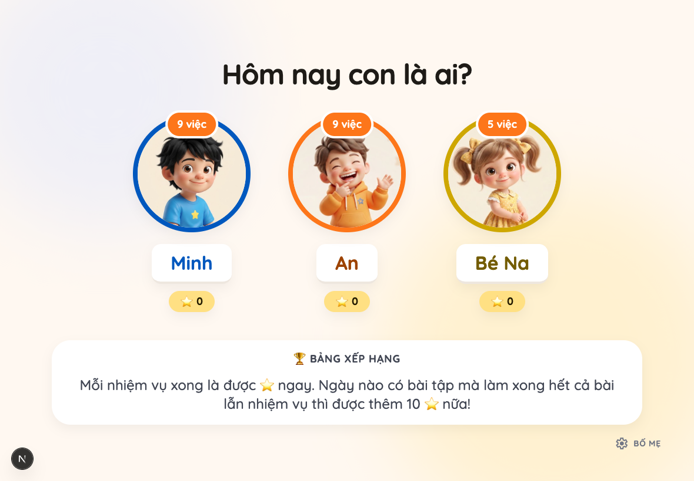
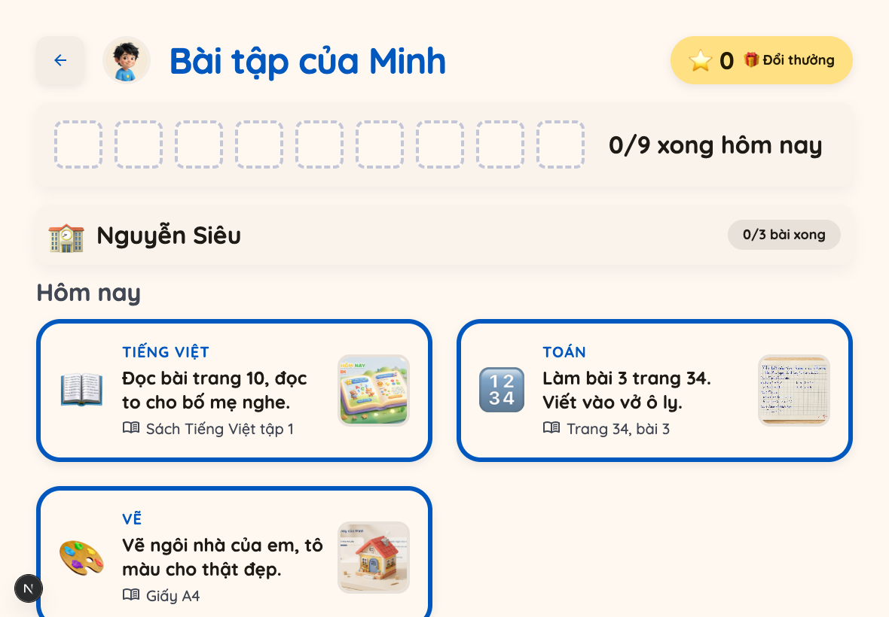
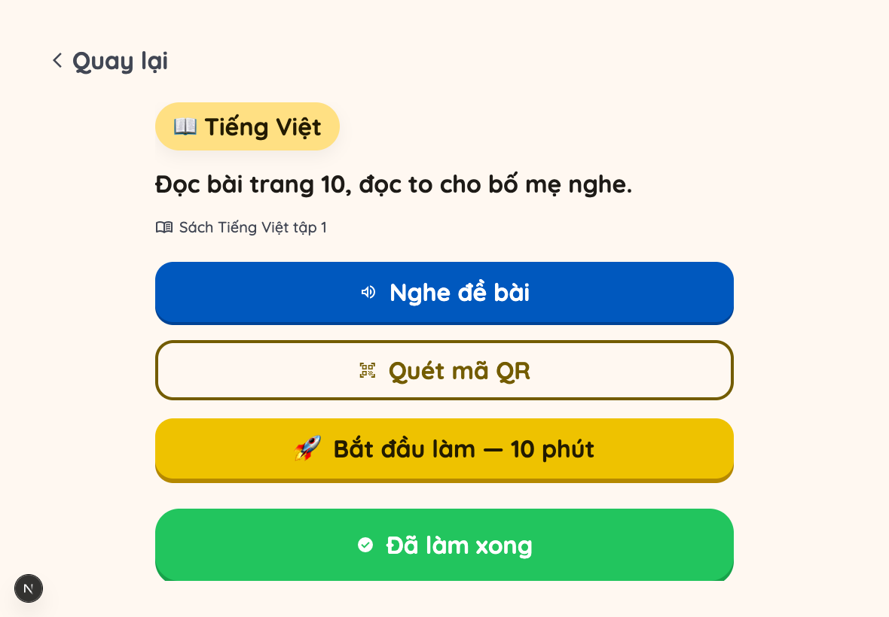
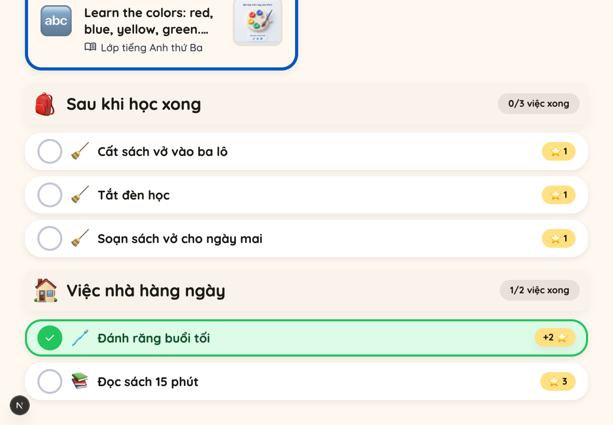
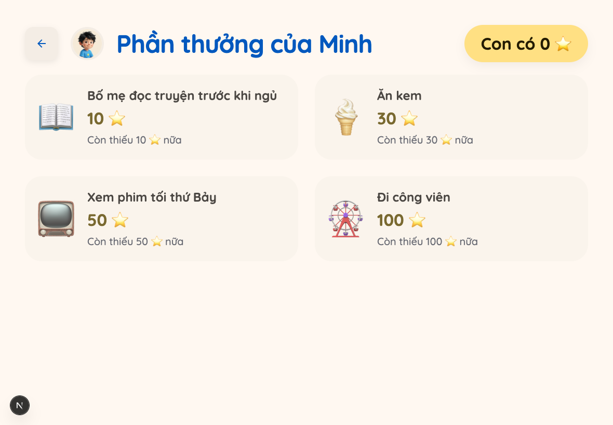

# Hướng dẫn cho bố mẹ

Đây là hướng dẫn dùng app **Bài tập về nhà**. Không cần biết gì về máy tính,
chỉ cần một chiếc điện thoại và một máy tính bảng (hoặc máy tính) cho các con.

---

## 1. App này giúp gì cho bố mẹ

- Cô giáo nhắn bài trong nhóm Zalo, bố mẹ **chụp ảnh hoặc dán tin nhắn** vào app,
  app tự tách thành từng đầu việc rõ ràng cho con.
- Con tự mở máy của mình, tự biết **hôm nay phải làm những gì**, làm xong tự tick
  — bố mẹ không phải ngồi nhắc từng bài.
- Bé chưa đọc được chữ vẫn dùng được: bấm nút loa là app **đọc đề bài thành tiếng**.
- Bố mẹ liếc điện thoại là biết **con nào xong, con nào còn thiếu, bài nào quá hạn**.
- Con làm xong được **sao ⭐**, đủ sao thì xin đổi phần thưởng do chính bố mẹ đặt ra.

---

## 2. Bắt đầu lần đầu

### Tạo nhà của mình

1. Mở đường dẫn của app trên **điện thoại của bố mẹ**.
2. Bấm **"Nhà mình chưa có — tạo nhà mới"**.
3. Đặt tên nhà (ví dụ *Nhà mình*) và **chọn một mã PIN 4 số**, nhập lại một lần
   nữa cho chắc.

### Mã PIN là gì

Mã PIN 4 số vừa là **mật khẩu** vừa là **tên gọi riêng của nhà mình**:

- Nhập PIN ở điện thoại bố mẹ → mở được phần của bố mẹ (thêm bài, xem tiến độ,
  duyệt thưởng).
- Nhập PIN một lần ở máy của các con → máy đó **nhớ luôn là máy của nhà mình**,
  từ đó các con mở lên là dùng được ngay, không phải nhập gì nữa. Nhập PIN ở máy
  của con **không** mở phần của bố mẹ, nên vẫn an toàn.
- Nhiều nhà cùng dùng chung một app, nên **hai nhà không được trùng mã PIN**.
  Nếu mã đã có nhà khác dùng, app sẽ báo để chọn mã khác.

> Ở màn nhập PIN của bố mẹ có ô **"Nhớ trên thiết bị này"** — mặc định không tick.
> **Đừng tick nếu đó là máy của các con.**

### Thêm con

Nhà mới tạo xong, app dẫn thẳng sang bước này. Mỗi con nhập: **Tên**, **Lớp**,
**Ảnh của con** (chưa có ảnh thì để tạm chữ cái đầu, thay sau) và **Màu riêng** để
các con tự nhận ra mình. Có bao nhiêu con thì thêm bấy nhiêu.

Sau này muốn thêm con nữa, vào **Cài đặt → "Hồ sơ các con" → "Thêm con"**. Cũng ở
chỗ đó, bấm vào một con để đổi tên, ảnh, lớp, màu riêng — hoặc xoá.

### Gắn máy của con vào nhà

Trên iPad/máy tính của con, mở app → màn **"Đây là máy của nhà nào?"** → nhập mã
PIN của nhà một lần. Xong, máy đó nhớ khoảng một năm.

---

## 3. Việc hằng ngày của bố mẹ

### Giao bài

Bấm **"Thêm bài"** ở thanh dưới cùng.

1. **Ảnh bài tập** — chụp ảnh tờ bài tập hoặc chọn ảnh cô gửi trong Zalo.
   **Hoặc dán nội dung** — dán thẳng tin nhắn của cô vào ô bên dưới.
2. **Giao cho con nào** — tick một hay nhiều con. Các con học cùng lớp được tick
   sẵn; mỗi con vẫn có bài riêng để tự tick, con này tick không ảnh hưởng con kia.
3. **Bài của lớp nào** — *Tự đoán* (đề tiếng Anh xếp vào Smartkid, còn lại vào
   Nguyễn Siêu), hoặc chọn tay. Sửa lại được sau.
4. **Hạn hoàn thành** — *Hôm nay* / *Mai* / *Chọn ngày*.
5. Bấm **"Tách bài tập"**, đợi vài giây.

Sau đó là màn **"Kiểm tra lại"**: app đã tách sẵn thành từng bài, bố mẹ đọc lướt
rồi sửa chỗ nào chưa đúng — chữ đề bài, môn, thời lượng dự kiến, giọng đọc
(🇻🇳 tiếng Việt / 🇬🇧 tiếng Anh), và chip 🎥 cho bài phải **quay video** (đọc to,
đọc thuộc lòng, thể dục...). Bấm **Lưu** là bài hiện ngay trên máy của con.

> App đọc ảnh không ra chữ, hay mạng trục trặc? Vẫn có nút **"Nhập tay"** để bố mẹ
> tự gõ từng bài — không bao giờ bị kẹt.

### Xem con làm tới đâu

Màn **Trang chủ** cho biết ngay: **Hoàn thành / Đang chờ / Quá hạn** trong khối
"Việc từ hôm nay trở đi", từng con xong mấy việc, và số ⭐ mỗi con đang có. Hai ô
**Hoàn thành / Đang chờ** (và tiến độ từng con ngay dưới) đếm cả **nhiệm vụ hàng
ngày** — đúng những việc con đang thấy trên máy của mình; riêng ô **Quá hạn** chỉ
đếm bài tập, vì một nhiệm vụ của hôm qua không phải bài quá hạn.

- Bấm vào tên một con → xem chi tiết từng bài của con đó, xem video con đã nộp,
  sửa hoặc xoá bài.
- **Nhiệm vụ** (thanh dưới) → danh sách bài tập cả nhà trong 7 ngày quanh hôm nay.
- **Nộp bài cho cô** (ở Trang chủ) → gom các video con đã quay cho lớp tiếng Anh
  theo từng ngày, đặt sẵn tên tệp dễ hiểu để gửi cho cô.

### Nhiệm vụ hàng ngày của con

Vào **Cài đặt → "Nhiệm vụ hàng ngày"** (cũng vào được từ dòng dẫn trên màn
**Thưởng**). Cả nhà dùng chung một danh sách; mặc định có sẵn 3 việc: cất sách vở
vào ba lô, tắt đèn học, soạn sách vở cho ngày mai — mỗi việc 1 ⭐.

Mỗi nhiệm vụ bố mẹ đặt được:

- **Tên** và **một icon** (một emoji — con chưa đọc thạo thì nhìn icon là biết).
- **Số ⭐** con được khi tick xong, từ **1 đến 10**.
- **Nhóm**: **"🎒 Sau khi học xong"** (dọn dẹp, chuẩn bị đồ dùng — 3 việc mặc định
  nằm ở đây) hoặc **"🏠 Việc nhà hàng ngày"** (việc nhà của con).
- **"Giao cho"**: mặc định **Cả nhà**, hoặc bấm chọn từng con.

Còn có hai nút mũi tên để đổi thứ tự, công tắc bật/tắt, và nút xoá.

Trên màn của con, các nhiệm vụ hiện thành **hai nhóm riêng** (đúng hai nhóm ở
trên) ở cuối danh sách hôm nay; con bấm tick ngay tại chỗ, không phải mở ra.
**Nhiệm vụ hiện MỖI NGÀY** — kể cả cuối tuần và những hôm bố mẹ không giao bài
tập nào.

Sửa danh sách chỉ ảnh hưởng những ngày **app tạo dòng sau đó**: tên, icon và số ⭐
đã chép sang việc của những ngày đã tạo nên giữ nguyên (riêng đổi **nhóm** thì
việc của hôm nay đổi chỗ theo ngay).

### Duyệt đổi thưởng

Vào **Thưởng** (thanh dưới).

- **Danh sách phần thưởng**: bố mẹ tự đặt tên, icon và **giá bằng ⭐** (ví dụ
  *Ăn kem* 30 ⭐, *Xem phim tối thứ Bảy* 50 ⭐). Bật/tắt hoặc xoá tuỳ ý.
- **Chờ duyệt**: con xin đổi thì hiện ở đây. Bấm **"Duyệt, trừ N ⭐"** hoặc
  **"Từ chối"**. **Chỉ khi bố mẹ duyệt thì sao của con mới bị trừ** — từ chối thì
  con giữ nguyên sao và xin lại được.

---

## 4. Việc hằng ngày của con

Con mở app trên máy của mình (máy đã gắn vào nhà thì vào thẳng, không phải nhập gì):

1. **"Hôm nay con là ai?"** — con bấm vào ảnh của mình. Ngay dưới ảnh là số ⭐ của
   từng anh chị em và **🏆 Bảng xếp hạng** cả nhà.
2. Con thấy danh sách bài hôm nay, chia theo nơi giao (trường, lớp tiếng Anh,
   khác), mỗi nhóm có tiến độ riêng.

3. Bấm vào một bài để mở chi tiết:

- **🔊 Nghe đề bài** — app đọc thành tiếng, đúng giọng Việt hay Anh theo bài.
- **Quét mã QR** — tờ bài tập giấy có in mã QR (đoạn nghe của nhà xuất bản) thì
  con soi bằng máy ảnh, app mở luôn cho con nghe.
- **🚀 Bắt đầu làm — N phút** — bấm là đồng hồ đếm ngược chạy. Có nhắc bằng lời
  mỗi 5 phút, hết giờ chỉ kêu nhẹ chứ **không phạt gì cả**.
- **Đã làm xong** — tick xong bài. Bài nào có 🎥 thì con **quay video ngay trong
  app**; gửi video xong tức là bài đó đã xong (không có nút tick riêng).

Nhiệm vụ hàng ngày thì con bấm tick ngay tại danh sách, không phải mở ra; tick
xong là ⭐ của nhiệm vụ đó cộng ngay, hiện luôn chip **"+N ⭐"** trên dòng vừa tick.
Xong hết cả bài lẫn nhiệm vụ, con thấy màn ăn mừng **"Giỏi quá!"**.

---

## 5. Sao ⭐ và phần thưởng

Luật hiện hành (đúng như app đang tính):

| Con làm gì | Được bao nhiêu |
| --- | --- |
| Ngày **có bài tập**, con xong hết **cả bài tập lẫn nhiệm vụ hàng ngày** | **+10 ⭐**, mỗi con mỗi ngày chỉ một lần |
| Mỗi bài làm xong **nhanh hơn thời lượng dự kiến của chính bài đó** | **+1 ⭐** |
| Mỗi **nhiệm vụ hàng ngày** con tick xong | **+ đúng số ⭐ bố mẹ đặt cho nhiệm vụ đó** |

Vài điều nên biết để khỏi thắc mắc:

- Muốn được **+1**, con phải bấm **"Bắt đầu làm"** rồi tick xong trước khi hết giờ.
  Con làm ra giấy trước rồi mới vào tick thì không có mốc giờ nào để so, nên không
  được +1. Làm đúng bằng thời lượng (5 phút cho bài 5 phút) cũng chưa tính là sớm.
- **Nhiệm vụ hàng ngày không có đồng hồ**, nên không bao giờ được +1 — nhưng vẫn
  phải tick hết mới được +10 của ngày.
- Ngày phải có **ít nhất một bài tập thật** mới tính +10 (chỉ tick vài nhiệm vụ
  thì chưa phải là "làm xong bài"). Nên cuối tuần không có bài, con tick hết nhiệm
  vụ thì được ⭐ của từng nhiệm vụ chứ **không** có +10.
- Mỗi nhiệm vụ chỉ cộng ⭐ **một lần**: con bỏ tick cũng **không bị rút** ⭐, mà
  tick lại cũng không được cộng thêm lần nữa.
- **Không tính lùi về quá khứ**: chỉ những ngày từ hôm tạo nhà trở đi mới được điểm.
- Con bấm nhầm **"Bắt đầu làm"**? Ngay dưới đồng hồ, trên chính máy của con, có
  nút nhỏ **"Bố mẹ đặt lại giờ"** — bố mẹ nhập mã PIN là bài quay về như chưa bấm.

**Số ⭐ con đang có = tổng sao kiếm được − những lần đổi thưởng bố mẹ đã duyệt.**
Không có chuyện bị trừ sao vì làm sai hay bỏ tick.

Con vào **🎁 Đổi thưởng** để xem mình còn thiếu bao nhiêu sao:

Con bấm chọn, app hỏi lại một lần rồi gửi cho bố mẹ. **Mỗi con chỉ có một yêu cầu
đang chờ cùng lúc.**

---

## 6. Câu hỏi thường gặp

**Quên mã PIN thì sao?**
App không có cách tự lấy lại mã — hãy hỏi người trong nhà đã đặt mã. Nếu điện
thoại của bố mẹ vẫn đang mở sẵn phần bố mẹ thì vào **Cài đặt → Đổi mã PIN**, chỗ
đó cần **mã hiện tại** rồi mới đặt được mã mới. Vì vậy nên ghi mã ra đâu đó an toàn.

**Đổi mã PIN có làm máy khác bị đăng xuất không?**
Không. Máy nào đang mở sẵn phần bố mẹ thì vẫn mở tiếp; mã mới chỉ cần cho những
lần mở sau.

**Thêm con thứ hai, thứ ba thế nào?**
**Cài đặt → "Hồ sơ các con" → "Thêm con"**, làm y như con đầu. Từ lần giao bài sau,
con mới hiện trong ô "Giao cho con nào".

**Hai bé sinh đôi học cùng lớp thì phải nhập bài hai lần à?**
Không. Nhập một lần, tick cả hai bé — mỗi bé nhận một bản riêng, tự tick, xoá bài
của bé này không ảnh hưởng bé kia.

**Con tick nhầm "Đã làm xong" thì sao?**
Con mở lại bài đó, bấm **"Chưa làm xong"** là bài quay về chưa xong. Sao con đã
được thì vẫn giữ, không bị mất.

**Con quay video nhưng muốn quay lại?**
Bấm **"Quay video khác"** — app chỉ giữ video mới nhất. Quay tối đa 10 phút mỗi bài.

**Hôm nay không giao bài thì con có nhiệm vụ hàng ngày không?**
Có. Nhiệm vụ hiện mỗi ngày, kể cả cuối tuần và ngày bố mẹ không giao bài tập nào.
Chỉ có điều ngày không có bài thì con chỉ được ⭐ của từng nhiệm vụ, không có +10.

**Tắt hoặc xoá một nhiệm vụ thì việc của hôm nay có biến mất không?**
Không. Tắt công tắc (hay xoá) chỉ làm app **thôi tạo** nhiệm vụ đó cho những ngày
chưa tạo. Ngày nào app đã tạo rồi thì con vẫn thấy và vẫn tick được — là hôm nay,
và cả ngày mai nếu tối nay bố mẹ đã giao bài cho ngày mai. Những lần con đã tick
và ⭐ đã cộng đều giữ nguyên.

**Con nhìn thấy mã PIN rồi, sợ con tự vào phần bố mẹ?**
Vào **Cài đặt → Đổi mã PIN** (cần mã hiện tại). Đổi xong máy của các con vẫn dùng
bình thường, không phải cài lại gì.

**Xoá hết bài cũ đi được không?**
Được. Vào **Nhiệm vụ → "Xoá tất cả bài tập và việc nhà"** — app hỏi lại hai nhịp
trước khi xoá. Việc này xoá luôn cả lịch sử việc nhà, cân nhắc trước khi bấm.
